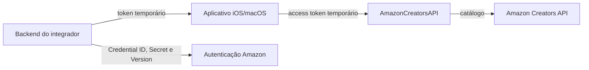

# AmazonCreatorsAPI

SDK Swift 6 para as operações de catálogo da [Amazon Creators API](https://affiliate-program.amazon.com/creatorsapi/docs/), com suporte mínimo a iOS 18 e macOS 15. Ele usa somente `URLSession`, não possui dependências externas e não importa UIKit.

O pacote concentra serialização, autenticação HTTP, limitação de taxa, retry, cache LRU em memória e decodificação tipada. A URL de produto emitida pela Amazon é exposta como `affiliateURL`; o SDK não a reconstrói nem altera seus parâmetros.

## O que o pacote resolve

- Busca de produtos, ASINs, variações e browse nodes com contratos Swift `Sendable`.
- Autorização Bearer para credenciais v2 e v3, com token fornecido pelo aplicativo ou por providers assíncronos, incluindo renovação após `401`.
- Rate limiting seguro sob concorrência, retry para `429`/`5xx` e respeito a `Retry-After`.
- Cache LRU limitado, que nunca guarda JSON inválido nem respostas parciais com `errors`.
- Validação local de limites, busca semântica, moeda, locale e browse node IDs antes de consumir cota.

## Pré-requisitos

Você precisa ser um Amazon Associate elegível, ter acesso à Creators API e usar um `partnerTag` válido para o marketplace escolhido. A Amazon gera **Credential ID**, **Secret** e **Version**, mas o aplicativo iOS não deve receber ou armazenar o Secret.

Obtenha o access token em um backend seguro e forneça somente esse token temporário ao SDK. Tokens normalmente expiram em uma hora. Para credenciais v2, informe a versão regional correta; para v3, use a versão v3 correspondente à origem do token.



Mantenha o Secret exclusivamente no backend. O app deve receber apenas o token temporário; o SDK nunca armazena Credential Secret, `client_secret` ou `refresh_token`.

## Instalação pelo Swift Package Manager

Adicione o pacote no Xcode por **File > Add Package Dependencies** ou no `Package.swift` do seu app:

```swift
dependencies: [
    .package(url: "https://github.com/SEU_USUARIO/AmazonCreatorsAPI.git", from: "1.0.0")
]
```

Depois, adicione o produto `AmazonCreatorsAPI` ao target do aplicativo e importe o módulo:

```swift
import AmazonCreatorsAPI
```

## Inicialização

```swift
let client = AmazonCreatorsClient(
    accessToken: accessTokenFromYourBackend,
    credentialVersion: .v3NorthAmerica,
    partnerTag: "seu-tag-20",
    marketplace: .brazil
)
```

Se o token for renovado, atualize o cliente sem recriá-lo:

```swift
try await client.updateAccessToken(newAccessToken)
```

Para obter e renovar tokens sob demanda, use providers assíncronos que consultem apenas uma origem controlada pelo integrador. Depois de um `401`, o SDK chama `accessTokenRefreshProvider` e repete exatamente uma vez a operação que falhou:

```swift
let client = AmazonCreatorsClient(
    accessTokenProvider: {
        try await tokenBroker.accessToken()
    },
    accessTokenRefreshProvider: {
        try await tokenBroker.refreshAccessToken()
    },
    credentialVersion: .v3NorthAmerica,
    partnerTag: "seu-tag-20",
    marketplace: .brazil
)
```

Se `accessTokenRefreshProvider` for omitido, o SDK chama `accessTokenProvider` novamente após o `401`. Use o provider específico quando o seu broker diferenciar uma leitura de cache de uma renovação forçada. Clientes criados com `accessToken` estático não podem ser renovados automaticamente; nesse caso, chame `updateAccessToken(_:)` depois de obter um token novo no backend.

## Exemplo prático: pesquisa para uma tela de catálogo

Monte o cliente em seu `AppContainer` ou na composição da feature e injete-o no ViewModel. A View recebe apenas o estado pronto; ela não acessa a rede nem cria dependências.

```swift
import AmazonCreatorsAPI
import Observation

@MainActor
@Observable
final class ProductSearchViewModel {
    enum State {
        case idle
        case loading
        case content
        case empty
        case failure(AmazonCreatorsError)
    }

    private let client: AmazonCreatorsClient
    private(set) var state: State = .idle
    private(set) var products: [Product] = []
    private(set) var partialProblems: [APIProblem] = []

    init(_ client: AmazonCreatorsClient) {
        self.client = client
    }

    func search(_ keywords: String) async {
        state = .loading

        do {
            let response = try await client.searchItems(
                SearchItemsRequest(
                    keywords: keywords,
                    options: SearchItemsOptions(
                        deliveryFlags: [.prime],
                        itemCount: 10,
                        resources: CatalogResource.productCard + [.features, .primaryLarge],
                        sortBy: .relevance
                    )
                )
            )

            products = response.items
            partialProblems = response.errors

            if products.isEmpty {
                state = .empty
            } else {
                state = .content
            }
        } catch let error as AmazonCreatorsError {
            state = .failure(error)
        } catch {
            state = .failure(.transport(error.localizedDescription))
        }
    }
}
```

Ao renderizar um produto, use `product.affiliateURL` diretamente para a navegação. Quando `partialProblems` não estiver vazio, mantenha os produtos válidos na tela e apresente um aviso discreto de resultado incompleto.

## Consultas de catálogo

### Buscar produtos por ASIN

```swift
let response = try await client.getItems(
    GetItemsRequest(itemIDs: ["B09B2SBHQK"])
)

for product in response.items {
    print(product.itemInfo?.title?.displayValue ?? product.asin)
    print(product.affiliateURL)
}
```

### Pesquisar produtos

```swift
let response = try await client.searchItems(
    SearchItemsRequest(
        keywords: "fone bluetooth",
        options: SearchItemsOptions(
            deliveryFlags: [.prime],
            itemCount: 10,
            resources: .productCard,
            sortBy: .relevance
        )
    )
)
```

### Consultar variações

```swift
let response = try await client.getVariations(
    GetVariationsRequest(
        asin: "B09B2SBHQK",
        variationCount: 10
    )
)
```

O resumo expõe `pageCount`, `variationCount` e `variationDimensions`. Use `pageCount` para buscar todas as páginas sem fazer tentativas além do necessário:

```swift
let firstPage = try await client.getVariations(
    GetVariationsRequest(asin: "B09B2SBHQK", variationCount: 10, variationPage: 1)
)
let pageCount = firstPage.variationSummary?.pageCount ?? 1
var allVariations = firstPage.items

if pageCount > 1 {
    for page in 2...pageCount {
        let response = try await client.getVariations(
            GetVariationsRequest(asin: "B09B2SBHQK", variationCount: 10, variationPage: page)
        )

        allVariations += response.items
    }
}
```

### Navegar por categorias

```swift
let response = try await client.getBrowseNodes(
    GetBrowseNodesRequest(ids: ["16209062011"])
)
```

As respostas podem conter itens válidos e erros parciais simultaneamente. Sempre inspecione `errors` quando houver resultados incompletos.

## Rotas inventariadas

Todas as rotas usam `POST`, `Content-Type: application/json`, o header `x-marketplace` e o mesmo marketplace no body. Para v3, o SDK envia `Authorization: Bearer <token>`; para v2, envia `Authorization: Bearer <token>, Version <versão>`.

| Rota | Estado na v1 | Finalidade |
|---|---:|---|
| `/catalog/v1/getItems` | Disponível | Busca até 10 ASINs. |
| `/catalog/v1/searchItems` | Disponível | Pesquisa e filtra produtos. |
| `/catalog/v1/getVariations` | Disponível | Retorna variações de um ASIN. |
| `/catalog/v1/getBrowseNodes` | Disponível | Retorna categorias e sua hierarquia. |
| `/catalog/v1/listFeeds` | Inventariada | Fora do escopo da v1. |
| `/catalog/v1/getFeed` | Inventariada | Fora do escopo da v1. |
| `/reports/v1/listReports` | Inventariada | Fora do escopo da v1. |
| `/reports/v1/getReport` | Inventariada | Fora do escopo da v1. |

## Recursos de catálogo

Os recursos são representados por `CatalogResource`. Peça somente os dados necessários para reduzir latência e tamanho de resposta.

| Recurso | Operações disponíveis |
|---|---|
| `browseNodeInfo.*` | GetItems, SearchItems, GetVariations |
| `images.primary.*`, `images.variants.*` | GetItems, SearchItems, GetVariations |
| `itemInfo.*` | GetItems, SearchItems, GetVariations |
| `offersV2.listings.*` | GetItems, SearchItems, GetVariations |
| `parentASIN` | GetItems, SearchItems |
| `searchRefinements` | SearchItems |
| `variationSummary.*` | GetVariations |
| `browseNodes.ancestor`, `browseNodes.children` | GetBrowseNodes |

`CatalogResource.productCard` solicita título, imagem média, preço e disponibilidade. Propriedades não requisitadas chegam como `nil`; recursos cuja estrutura varia por categoria são preservados em `AmazonJSONValue`. Ao requisitar `.browseNodesSalesRank`, o valor vem em `Product.browseNodeInfo?.browseNodes?[...].salesRank`.

## Rede, cache e limites

- O padrão é 1 requisição por segundo por cliente, compatível com a cota inicial da Amazon. O limitador reserva cada slot antes de suspender uma tarefa, portanto rajadas concorrentes não liberam duas chamadas no mesmo intervalo.
- A cota pertence à credencial, não ao objeto. Prefira um cliente compartilhado por credencial em vez de criar instâncias para contornar o limite local.
- O SDK tenta novamente somente `429` e `5xx`, com backoff exponencial, jitter e `Retry-After` quando o servidor o fornece. Falhas de validação, autenticação e decodificação não são repetidas.
- O cache em memória é habilitado por padrão e usa LRU. O limite padrão é 256 respostas; respostas com ofertas ou dados de browse nodes expiram em 1 hora, e as demais em 1 dia.
- Apenas respostas `2xx` que decodificam com sucesso e não contêm `errors` entram no cache. Assim, um JSON inválido ou resultado parcial nunca fica preso até o TTL.
- A cota diária é determinada pela Amazon e compartilhada entre os consumidores da credencial; o SDK não tenta persistir ou inferir esse limite localmente.

```swift
let configuration = AmazonCreatorsConfiguration(
    cachePolicy: .memory,
    maxCachedResponses: 300,
    requestsPerSecond: 1,
    maxRetryAttempts: 2
)
```

Use `cachePolicy: .disabled` em fluxos que exigem uma leitura de rede a cada chamada, como uma confirmação manual de preço imediatamente antes de exibir um dado sensível ao tempo.

## Validação antes da rede

O SDK rejeita antes da chamada valores que desperdiçariam cota: busca sem termo (`keywords`, `actor`, `artist`, `author`, `brand` ou `title`), strings vazias, preços não positivos ou invertidos, currency code inválido, locale fora de `ll_CC` e browse node IDs que não sejam inteiros ASCII positivos. Erros locais chegam como `AmazonCreatorsError.invalidRequest`.

## Erros

`AmazonCreatorsError` diferencia validação local, autenticação, acesso negado, throttle, não encontrado, servidor, transporte e decodificação.

| Erro | Ação recomendada |
|---|---|
| `invalidRequest` | Corrija o input local; nenhuma chamada foi enviada. |
| `unauthorized` | Com providers, ocorre somente após a renovação e a repetição automáticas. Verifique o broker; com token estático, renove no backend e chame `updateAccessToken(_:)`. |
| `accessDenied` | Verifique `partnerTag`, marketplace e permissões da credencial. |
| `throttled` | Reduza a taxa no escopo da credencial; o SDK já respeita retries limitados. |
| `server` ou `transport` | Mostre uma ação de tentar novamente para o usuário. |
| `decoding` | Registre o payload de forma segura e atualize o SDK/modelo para uma mudança de contrato. |

```swift
do {
    let response = try await client.getItems(GetItemsRequest(itemIDs: ["B09B2SBHQK"]))

    // Use response.items mesmo se a Amazon também retornar erros parciais.
} catch let error as AmazonCreatorsError {
    switch error {
    case .unauthorized:
        // Com token estático, obtenha outro token no backend e atualize o cliente.
        // Com providers, a renovação e uma repetição já foram tentadas pelo SDK.
        break
    case .invalidRequest:
        // Apresente o erro de input sem repetir a chamada.
        break
    default:
        // Registre ou converta o erro para o estado de apresentação da feature.
        break
    }
}
```

## Atribuição de afiliado

Envie sempre o `partnerTag` adequado ao marketplace e use o `affiliateURL` retornado pela Amazon sem editar seus parâmetros. Alterar essa URL pode impedir a atribuição de comissões.

## Documentação oficial

- [Using cURL](https://affiliate-program.amazon.com/creatorsapi/docs/en-us/get-started/using-curl)
- [Headers e parâmetros](https://affiliate-program.amazon.com/creatorsapi/docs/en-us/concepts/common-request-headers-and-parameters)
- [Limites de API](https://affiliate-program.amazon.com/creatorsapi/docs/en-us/concepts/api-rates)
- [Boas práticas](https://affiliate-program.amazon.com/creatorsapi/docs/en-us/concepts/best-programming-practices)
